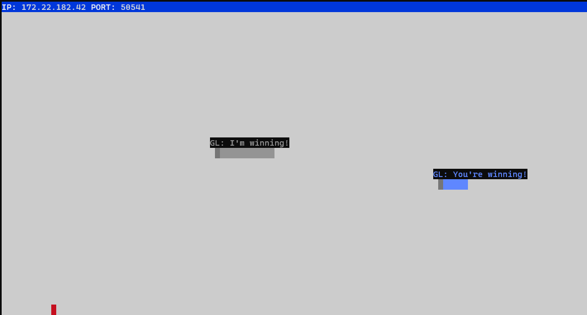

# Snek Game

Snek (Snake) game is a very popular video game. It is a video game concept where the player maneuvers a dot and grows it by ‘eating’ pieces of food. The goal is to grow it as long as possible without bumping into the side walls, bumping into itself or another player, upon which it dies.

This is simply a multiplayer take on the genre.

Before you can run this client, you will need to be running the server side which you can download and install from <a href="https://github.com/lighthouse-labs/snek-multiplayer">here</a>. 

## Final Product

### Controls
You have options! Use the <b>Arrow keys</b> or <b>wsad</b> keys to navigate:
- <b>"w"</b> : Up
- <b>"s"</b> : Down
- <b>"a"</b> : Left
- <b>"d"</b> : Right

### Special Keys
These are the special keys to send canned messages on the server:
- <b>"m"</b> : How are you?
- <b>"k"</b> : This is fun!
- <b>"n"</b> : You're winning!
- <b>","</b> : I'm winning!

## Getting Started

1. Follow steps inside the <a href="https://github.com/lighthouse-labs/snek-multiplayer">snek server repo</a> to run the server side
2. Run the development snake client using the `node play.js` command.

  
 
